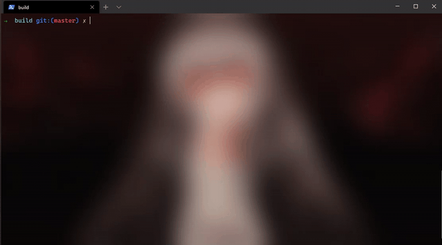

## L10

**Headers:**
  * [array.h](https://github.com/katohawkei/College/blob/master/include/array.h)
    
    [source code](https://github.com/katohawkei/College/blob/master/lib/array.c)
  
 **Source code:**
  * [1.c](https://github.com/katohawkei/College/blob/master/src/term2/l10/1.c)
  * [2.c](https://github.com/katohawkei/College/blob/master/src/term2/l10/2.c)
  * [3.c](https://github.com/katohawkei/College/blob/master/src/term2/l10/3.c)
  * [4.c](https://github.com/katohawkei/College/blob/master/src/term2/l10/4.c)
  
 **Executed code:**
  
  * 1
    
  

  * 2
    
  
  
  * 3
  
  
  
  * 4
  
  
